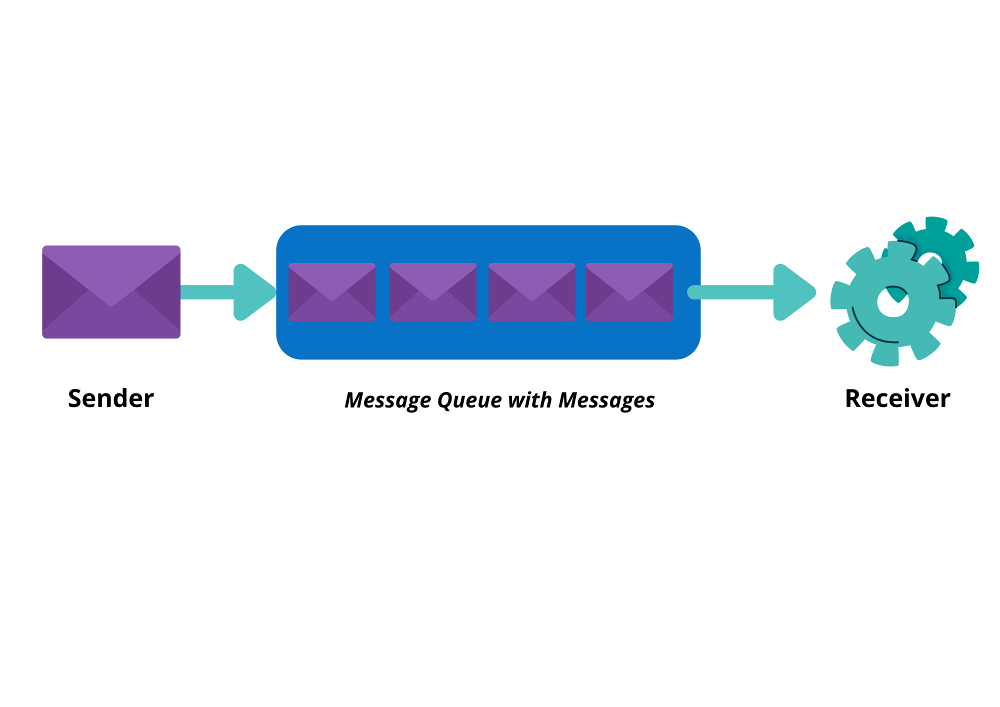
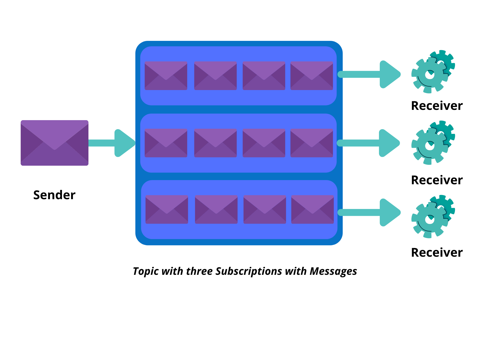
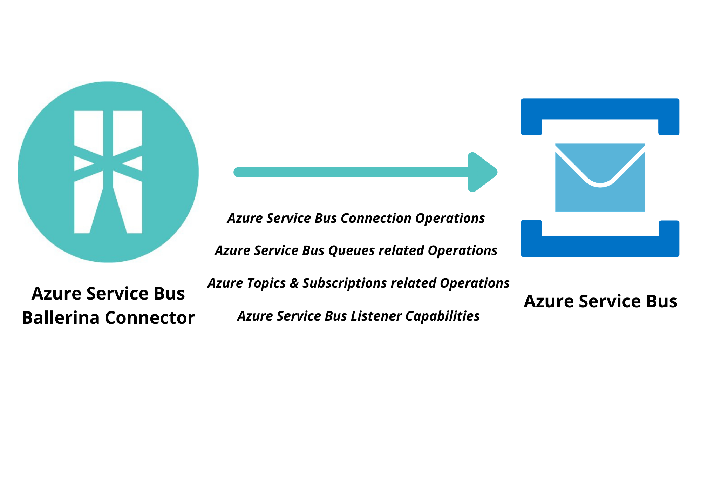

# Ballerina Azure Service Bus Connector

[](https://github.com/ballerina-platform/module-ballerinax-azure-service-bus/actions?query=workflow%3ACI)
[](https://github.com/ballerina-platform/module-ballerinax-azure-service-bus/commits/master)
[](https://opensource.org/licenses/Apache-2.0)

Connects to Microsoft Azure Service Bus using Ballerina.

# Introduction

## What is Azure Service Bus?

The [Azure Service Bus](https://azure.microsoft.com/en-us/services/service-bus/) is a reliable cloud messaging as 
a service (Maas) and simple hybrid integration. It is an enterprise message broker with message queues and topics with 
publisher/subscriber capabilities. It is used to decouple applications and services from each other. Data is transferred 
between different applications and services using messages. You can find more information [here](https://docs.microsoft.com/en-us/azure/service-bus-messaging/).

The primary wire protocol for Service Bus is [Advanced Messaging Queueing Protocol](https://docs.microsoft.com/en-us/azure/service-bus-messaging/service-bus-amqp-overview) 
(AMQP) 1.0, an open ISO/IEC standard and it can be used from any AMQP 1.0 compliant protocol client. Service Bus 
supports standard [AMQP 1.0]((https://docs.microsoft.com/en-us/azure/service-bus-messaging/service-bus-amqp-overview)) 
and [HTTP or REST](https://docs.microsoft.com/en-us/rest/api/servicebus/) protocols and their respective security 
facilities, including transport-level security (TLS). Clients can be authorized for access using [Shared Access Signature](https://docs.microsoft.com/en-us/azure/service-bus-messaging/service-bus-sas) 
or [Azure Active Directory](https://docs.microsoft.com/en-us/azure/service-bus-messaging/service-bus-authentication-and-authorization) 
role-based security.

### Azure Service Bus Concepts

1. Namespaces.
   A namespace is a container for all messaging components. We can have multiple queues and topics in a namespace. 
   The namespaces serve as application containers. In terms of terminology of other brokers, a namespace can be compared 
   to a "server", but the concepts aren't the same.
   
2. Queues.
   Messages are sent to and received from queues. The messages are stored in queues until the receiving application is 
   available to receive and process them. Messages are ordered and time stamped on arrival in queues. Messages are 
   delivered in pull mode where messages are delivered only when requested.
   

3. Topics.
   Topics are used to send and receive messages in publisher/subscriber models. Topics can have multiple, independent 
   subscriptions that are like queues, which attach to the topic from the receiver side. While a queue is often used 
   for point-to-point communication, topics are used in publish/subscribe scenarios. A subscriber to a topic can receive 
   a copy of each message sent to that topic. You can define rules on a subscription. A subscription rule has a filter 
   to define a condition for the message to be copied into the subscription and an optional action that can modify 
   message metadata.
   

## Key Features of Azure Service Bus
* Load-balancing work across competing workers
* Safely routing and transferring data and control across service and application boundaries
* Coordinating transactional work that requires a high-degree of reliability

## Connector Overview
The Azure Service Bus Ballerina Connector is used to connect to the Azure Service Bus to send and receive messages. 
You can perform actions such as send to queue, send to topic, receive from queue, receive from subscription, etc.



[Azure Service Bus' primary protocol is AMQP 1.0](https://docs.microsoft.com/en-us/azure/service-bus-messaging/service-bus-amqp-overview) 
and it can be used from any AMQP 1.0 compliant protocol client. 
This connector makes use of an AMQP 1.0 compliant protocol client for interoperability.

Service Bus provides a Microsoft supported native API and this connector makes use of this public API. 
Service Bus service APIs access the Service Bus service directly, and perform various management operations at the 
entity level, rather than at the namespace level (such as sending a message to a queue). This connector supports these 
basic operations. These APIs use Shared Access Signature(SAS) authentication and this connector supports SAS authentication.

# Prerequisites

* An Azure account and subscription.
  If you don't have an Azure subscription, [sign up for a free Azure account](https://azure.microsoft.com/free/).

* A Service Bus namespace.
  If you don't have [a service bus namespace](https://docs.microsoft.com/en-us/azure/service-bus-messaging/service-bus-create-namespace-portal),
  learn how to create your Service Bus namespace.

* A messaging entity, such as a queue, topic or subscription.
  If you don't have these items, learn how to
    * [Create a queue in the Azure portal](https://docs.microsoft.com/en-us/azure/service-bus-messaging/service-bus-quickstart-portal#create-a-queue-in-the-azure-portal)
    * [Create a Topic using the Azure portal](https://docs.microsoft.com/en-us/azure/service-bus-messaging/service-bus-quickstart-topics-subscriptions-portal#create-a-topic-using-the-azure-portal)
    * [Create Subscriptions to the Topic](https://docs.microsoft.com/en-us/azure/service-bus-messaging/service-bus-quickstart-topics-subscriptions-portal#create-subscriptions-to-the-topic)

* Java 11 Installed
  Java Development Kit (JDK) with version 11 is required.

* Ballerina SLAlpha5 Installed
  Ballerina Swan Lake Alpha 5 is required.

* Shared Access Signature (SAS) Authentication Credentials
    * Connection String
    * Entity Path

## Configuration
Instantiate the connector by giving authorization credentials that a client application can use to send/receive messages
to/from the queue/topic/subscription.

### Getting the authorization credentials

#### For Service Bus Queues

1. Make sure you have an Azure subscription. If you don't have an Azure subscription, you can create a
   [free account](https://azure.microsoft.com/en-us/free/) before you begin.

2. [Create a namespace in the Azure portal](https://docs.microsoft.com/en-us/azure/service-bus-messaging/service-bus-quickstart-portal#create-a-namespace-in-the-azure-portal)

3. [Get the connection string](https://docs.microsoft.com/en-us/azure/service-bus-messaging/service-bus-quickstart-portal#get-the-connection-string)

4. [Create a queue in the Azure portal & get Entity Path](https://docs.microsoft.com/en-us/azure/service-bus-messaging/service-bus-quickstart-portal#create-a-queue-in-the-azure-portal). 
   It is in the format ‘queueName’.

#### For Service Bus Topics and Subscriptions

1. Make sure you have an Azure subscription. If you don't have an Azure subscription, you can create a
   [free account](https://azure.microsoft.com/en-us/free/) before you begin.

2. [Create a namespace in the Azure portal](https://docs.microsoft.com/en-us/azure/service-bus-messaging/service-bus-quickstart-portal#create-a-namespace-in-the-azure-portal)

3. [Get the connection string](https://docs.microsoft.com/en-us/azure/service-bus-messaging/service-bus-quickstart-portal#get-the-connection-string)

4. [Create a topic in the Azure portal & get Entity Path](https://docs.microsoft.com/en-us/azure/service-bus-messaging/service-bus-quickstart-topics-subscriptions-portal#create-a-topic-using-the-azure-portal). 
   It's in the format ‘topicName‘.

5. [Create a subscription in the Azure portal & get Entity Path](https://docs.microsoft.com/en-us/azure/service-bus-messaging/service-bus-quickstart-topics-subscriptions-portal#create-subscriptions-to-the-topic). 
   It’s in the format ‘topicName/subscriptions/subscriptionName’.
   

# Supported Versions & Limitations

## Supported Versions
|                     |    Version                  |
|:-------------------:|:---------------------------:|
| Ballerina Language  | Swan-Lake-Alpha5            |
| Service Bus API     | v3.5.1                      |

# Quickstart(s)

## Send and Receive Messages from the Azure Service Bus Queue

This is the simplest scenario to send and receive messages from an Azure Service Bus queue. You need to obtain 
a connection string of the name space and an entity path name of the queue you want to send and receive messages from. 
You must have the following prerequisites in order to obtain these configurations.

* An Azure account and subscription.
  If you don't have an Azure subscription, [sign up for a free Azure account](https://azure.microsoft.com/free/).

* A Service Bus namespace.
  If you don't have [a service bus namespace](https://docs.microsoft.com/en-us/azure/service-bus-messaging/service-bus-create-namespace-portal),
  learn how to create your Service Bus namespace.
  
* Connection String.
  [Get the connection string](https://docs.microsoft.com/en-us/azure/service-bus-messaging/service-bus-quickstart-portal#get-the-connection-string) from the service bus namespace you created.

* Entity Path.
  A messaging entity, in this case a queue. If you don't have these items, learn how to [Create a queue in the Azure portal](https://docs.microsoft.com/en-us/azure/service-bus-messaging/service-bus-quickstart-portal#create-a-queue-in-the-azure-portal) 
  and get the name of the queue you created. The Entity path is in the format ‘queueName’.
  (Note: The Entity path is in the format ‘topicName‘ for a topic and ‘topicName/subscriptions/subscriptionName’ for a 
  subscription.)

### Step 1: Import the Azure Service Bus Ballerina Library
First, import the ballerinax/asb module into the Ballerina project.
```ballerina
    import ballerinax/asb as asb;
```

### Step 2: Initialize the Azure Service Bus Client Configuration
You can now make the connection configuration using the connection string.
```ballerina
    asb:AsbConnectionConfiguration config = {
       connectionString: <CONNECTION_STRING>
    };
```

### Step 3: Create an Azure Service Bus Client using the connection configuration
You can now make an Azure service bus client using the connection configuration.
```ballerina
    asb:AsbClient asbClient = new (config);
```

### Step 4: Create a Queue Sender using the Azure service bus client
You can now make a sender connection using the Azure service bus client. Provide the `queueName` as a parameter.
```ballerina
    handle queueSender = checkpanic asbClient->createQueueSender(queueName);
```

### Step 5 : Create a Queue Receiver using the Azure service bus client
You can now make a receiver connection using the connection configuration. Provide the `queueName` as a parameter. 
Optionally you can provide the receive mode which is PEEKLOCK by default.
```ballerina
    handle queueReceiver = checkpanic asbClient->createQueueReceiver(queueName, asb:RECEIVEANDDELETE);
```

### Step 6: Initialize the Input Values
Initialize the message to be sent with message body, optional parameters and properties.
```ballerina
    // Input values
    string stringContent = "This is My Message Body"; 
    byte[] byteContent = stringContent.toBytes();
    map<string> properties = {a: "propertyValue1", b: "propertyValue2"};
    int timeToLive = 60; // In seconds
    int serverWaitTime = 60; // In seconds

    asb:ApplicationProperties applicationProperties = {
        properties: {a: "propertyValue1", b: "propertyValue2"}
    };

    asb:Message message1 = {
        body: byteContent,
        contentType: asb:TEXT,
        timeToLive: timeToLive,
        applicationProperties: applicationProperties
    };
```

### Step 7: Send a Message to Azure Service Bus
You can now send a message to the configured azure service bus entity with message body, optional parameters and 
properties. Here we have shown how to send a text message parsed to the byte array format.
```ballerina
    checkpanic asbClient->send(queueSender, message1);
```

### Step 8: Receive a Message from Azure Service Bus
You can now receive a message from the configured azure service bus entity.
```ballerina
    asb:Message|asb:Error? messageReceived = asbClient->receive(queueReceiver, serverWaitTime);

    if (messageReceived is asb:Message) {
        log:printInfo("Reading Received Message : " + messageReceived.toString());
    } else if (messageReceived is ()) {
        log:printError("No message in the queue.");
    } else {
        log:printError("Receiving message via Asb receiver connection failed.");
    }
```

### Step 9: Close Sender Connection
You can now close the sender connection.
```ballerina
    checkpanic asbClient->closeSender(queueSender);
```

### Step 10: Close Receiver Connection
You can now close the receiver connection.
```ballerina
    checkpanic asbClient->closeReceiver(queueReceiver);
```

## Send and Listen to Messages from the Azure Service Bus Queue

This is the simplest scenario to listen to messages from an Azure Service Bus queue. You need to obtain a connection 
string of the name space and an entity path name of the queue you want to listen messages from. You must have the 
following prerequisites in order to obtain these configurations.

* An Azure account and subscription.
  If you don't have an Azure subscription, [sign up for a free Azure account](https://azure.microsoft.com/free/).

* A Service Bus namespace.
  If you don't have [a service bus namespace](https://docs.microsoft.com/en-us/azure/service-bus-messaging/service-bus-create-namespace-portal),
  learn how to create your Service Bus namespace.

* Connection String.
  [Get the connection string](https://docs.microsoft.com/en-us/azure/service-bus-messaging/service-bus-quickstart-portal#get-the-connection-string) from the service bus namespace you created.

* Entity Path.
  A messaging entity, in this case a queue. If you don't have these items, learn how to [Create a queue in the Azure portal](https://docs.microsoft.com/en-us/azure/service-bus-messaging/service-bus-quickstart-portal#create-a-queue-in-the-azure-portal)
  and get the name of the queue you created. The Entity path is in the format ‘queueName’.
  (Note: The Entity path is in the format ‘topicName‘ for a topic and ‘topicName/subscriptions/subscriptionName’ for a
  subscription.)

### Step 1: Import the Azure Service Bus Ballerina Library
First, import the ballerinax/asb module into the Ballerina project.
```ballerina
    import ballerinax/asb as asb;
```

### Step 2: Initialize the Azure Service Bus Client Configuration
You can now make the connection configuration using the connection string.
```ballerina
    asb:ConnectionConfiguration config = {
       connectionString: <CONNECTION_STRING>
    };
```

### Step 3: Create an Azure Service Bus Client using the connection configuration
You can now make an Azure service bus client using the connection configuration.
```ballerina
    asb:AsbClient asbClient = new (config);
```

### Step 4: Create a Queue Sender using the Azure service bus client
You can now make a sender connection using the Azure service bus client. Provide the `queueName` as a parameter.
```ballerina
    handle queueSender = checkpanic asbClient->createQueueSender(queueName);
```

### Step 5: Initialize the Input Values
Initialize the message to be sent with message body, optional parameters and properties.
```ballerina
    // Input values
    string stringContent = "This is My Message Body"; 
    byte[] byteContent = stringContent.toBytes();
    map<string> properties = {a: "propertyValue1", b: "propertyValue2"};
    int timeToLive = 60; // In seconds
    int serverWaitTime = 60; // In seconds

    asb:ApplicationProperties applicationProperties = {
        properties: {a: "propertyValue1", b: "propertyValue2"}
    };

    asb:Message message1 = {
        body: byteContent,
        contentType: asb:TEXT,
        timeToLive: timeToLive,
        applicationProperties: applicationProperties
    };
```

### Step 6: Send a Message to Azure Service Bus
You can now send a message to the configured azure service bus entity with message body, optional parameters and 
properties. Here we have shown how to send a text message parsed to the byte array format.
```ballerina
    checkpanic asbClient->send(queueSender, message1);
```

### Step 7: Create a service object with the service configuration and the service logic to execute based on the message received
You can now create a service object with the service configuration specified using the @asb:ServiceConfig annotation. 
We need to give the connection string and the entity path of the queue we are to listen messages from. We can optionally provide the receive mode. Default mode is the PEEKLOCK mode. Then we can give the service logic to execute when a message is received inside the onMessage remote function.
```ballerina
    asb:Service asyncTestService =
    @asb:ServiceConfig {
        entityConfig: {
            connectionString: <CONNECTION_STRING>,
            entityPath: <ENTITY_PATH>,
            receiveMode: <PEEKLOCK_OR_RECEIVEONDELETE>
        }
    }
    service object {
        remote function onMessage(asb:Message message) {
            log:printInfo("The message received: " + message.toString());
            // Write your logic here
        }
    };
```

### Step 8: Initialize the ASB Listener  and Asynchronously listen to messages from the Azure Service Bus Queue
You can now initialize the ASB Listener and attach the service object with the listener. Then the user can start the 
listener and asynchronously listen to messages from the azure service bus connection and execute the service logic 
based on the message received. Here we have sent the current worker to sleep for 20 seconds. You can detach the service 
from the listener endpoint at any instance and stop listening to messages. You can gracefully stop listening by 
detaching from the listener and by terminating the connection. You can also immediately stop listening by terminating 
the connection with the Azure Service Bus.
```ballerina
    asb:Listener? channelListener = new();
    if (channelListener is asb:Listener) {
        checkpanic channelListener.attach(asyncTestService);
        checkpanic channelListener.'start();
        log:printInfo("start listening");
        runtime:sleep(20);
        log:printInfo("end listening");
        checkpanic channelListener.detach(asyncTestService);
        checkpanic channelListener.gracefulStop();
        checkpanic channelListener.immediateStop();
    }
```

### Step 9: Close Sender Connection
You can now close the sender connection.
```ballerina
    checkpanic asbClient->closeSender(queueSender);
```

# Samples

1. Send and Receive Message from Queue
This is the basic scenario of sending and receiving a message from a queue. A user must create a sender connection and 
a receiver connection with the azure service bus to send and receive a message. The message is passed as 
a parameter to the send operation. The user can receive the Message object at the other receiver end.

Sample is available at:
https://github.com/ballerina-platform/module-ballerinax-azure-service-bus/blob/main/asb-ballerina/samples/send_and_receive_message_from_queue.bal

```ballerina
import ballerina/log;
import ballerinax/asb;

// Connection Configurations
configurable string connectionString = ?;
configurable string queueName = ?;

public function main() {

    // Input values
    string stringContent = "This is My Message Body"; 
    byte[] byteContent = stringContent.toBytes();
    map<string> properties = {a: "propertyValue1", b: "propertyValue2"};
    int timeToLive = 60; // In seconds
    int serverWaitTime = 60; // In seconds

    asb:ApplicationProperties applicationProperties = {
        properties: {a: "propertyValue1", b: "propertyValue2"}
    };

    asb:Message message1 = {
        body: byteContent,
        contentType: asb:TEXT,
        timeToLive: timeToLive,
        applicationProperties: applicationProperties
    };

    asb:AsbConnectionConfiguration config = {
        connectionString: connectionString
    };

    asb:AsbClient asbClient = new (config);

    log:printInfo("Creating Asb sender connection.");
    handle queueSender = checkpanic asbClient->createQueueSender(queueName);

    log:printInfo("Creating Asb receiver connection.");
    handle queueReceiver = checkpanic asbClient->createQueueReceiver(queueName, asb:RECEIVEANDDELETE);

    log:printInfo("Sending via Asb sender connection.");
    checkpanic asbClient->send(queueSender, message1);

    log:printInfo("Receiving from Asb receiver connection.");
    asb:Message|asb:Error? messageReceived = asbClient->receive(queueReceiver, serverWaitTime);

    if (messageReceived is asb:Message) {
        log:printInfo("Reading Received Message : " + messageReceived.toString());
    } else if (messageReceived is ()) {
        log:printError("No message in the queue.");
    } else {
        log:printError("Receiving message via Asb receiver connection failed.");
    }

    log:printInfo("Closing Asb sender connection.");
    checkpanic asbClient->closeSender(queueSender);

    log:printInfo("Closing Asb receiver connection.");
    checkpanic asbClient->closeReceiver(queueReceiver);
}    
```

2. Send and Receive Batch from Queue
This is the basic scenario of sending and receiving a batch of messages from a queue. A user must create a sender 
connection and a receiver connection with the azure service bus to send and receive a message. The batch message is 
passed as a parameter to the send operation. The user can receive the batch message at the other receiver end.

Sample is available at:
https://github.com/ballerina-platform/module-ballerinax-azure-service-bus/blob/main/asb-ballerina/samples/send_and_receive_batch_from_queue.bal

```ballerina
import ballerina/log;
import ballerinax/asb;

// Connection Configurations
configurable string connectionString = ?;
configurable string topicName = ?;
configurable string subscriptionName1 = ?;

public function main() {

    // Input values
    string stringContent = "This is My Message Body"; 
    byte[] byteContent = stringContent.toBytes();
    map<string> properties = {a: "propertyValue1", b: "propertyValue2"};
    int timeToLive = 60; // In seconds
    int serverWaitTime = 60; // In seconds
    int maxMessageCount = 2;

    asb:ApplicationProperties applicationProperties = {
        properties: properties
    };

    asb:Message message1 = {
        body: byteContent,
        contentType: asb:TEXT,
        timeToLive: timeToLive
    };

    asb:Message message2 = {
        body: byteContent,
        contentType: asb:TEXT,
        timeToLive: timeToLive
    };

    asb:MessageBatch messages = {
        messageCount: 2,
        messages: [message1, message2]
    };

    asb:AsbConnectionConfiguration config = {
        connectionString: connectionString
    };

    asb:AsbClient asbClient = new (config);

    log:printInfo("Creating Asb sender connection.");
    handle topicSender = checkpanic asbClient->createTopicSender(topicName);

    log:printInfo("Creating Asb receiver connection.");
    handle subscriptionReceiver = 
        checkpanic asbClient->createSubscriptionReceiver(topicName, subscriptionName1, asb:RECEIVEANDDELETE);

    log:printInfo("Sending via Asb sender connection.");
    checkpanic asbClient->sendBatch(topicSender, messages);

    log:printInfo("Receiving from Asb receiver connection.");
    asb:MessageBatch|asb:Error? messageReceived = 
        asbClient->receiveBatch(subscriptionReceiver, maxMessageCount, serverWaitTime);

    if (messageReceived is asb:MessageBatch) {
        foreach asb:Message message in messageReceived.messages {
            if (message.toString() != "") {
                log:printInfo("Reading Received Message : " + message.toString());
            }
        }
    } else if (messageReceived is ()) {
        log:printError("No message in the subscription.");
    } else {
        log:printError("Receiving message via Asb receiver connection failed.");
    }

    log:printInfo("Closing Asb sender connection.");
    checkpanic asbClient->closeSender(topicSender);

    log:printInfo("Closing Asb receiver connection.");
    checkpanic asbClient->closeReceiver(subscriptionReceiver);
}    
```

3. Send to Topic and Receive from Subscription
This is the basic scenario of sending a message to a topic and receiving a message from a subscription. A user must 
create a sender connection and a receiver connection with the azure service bus to send and receive a message. 
The message is passed as a parameter to the send operation. The user can receive the Message at the other receiver end.

Sample is available at:
https://github.com/ballerina-platform/module-ballerinax-azure-service-bus/blob/main/asb-ballerina/samples/send_to_topic_and_receive_from_subscription.bal

```ballerina
import ballerina/log;
import ballerinax/asb;

// Connection Configurations
configurable string connectionString = ?;
configurable string topicName = ?;
configurable string subscriptionName1 = ?;

public function main() {

    // Input values
    string stringContent = "This is My Message Body"; 
    byte[] byteContent = stringContent.toBytes();
    map<string> properties = {a: "propertyValue1", b: "propertyValue2"};
    int timeToLive = 60; // In seconds
    int serverWaitTime = 60; // In seconds

    asb:ApplicationProperties applicationProperties = {
        properties: {a: "propertyValue1", b: "propertyValue2"}
    };

    asb:Message message1 = {
        body: byteContent,
        contentType: asb:TEXT,
        timeToLive: timeToLive,
        applicationProperties: applicationProperties
    };

    asb:AsbConnectionConfiguration config = {
        connectionString: connectionString
    };

    asb:AsbClient asbClient = new (config);

    log:printInfo("Creating Asb sender connection.");
    handle topicSender = checkpanic asbClient->createTopicSender(topicName);

    log:printInfo("Creating Asb receiver connection.");
    handle subscriptionReceiver = 
        checkpanic asbClient->createSubscriptionReceiver(topicName, subscriptionName1, asb:RECEIVEANDDELETE);

    log:printInfo("Sending via Asb sender connection.");
    checkpanic asbClient->send(topicSender, message1);

    log:printInfo("Receiving from Asb receiver connection.");
    asb:Message|asb:Error? messageReceived = asbClient->receive(subscriptionReceiver, serverWaitTime);

    if (messageReceived is asb:Message) {
        log:printInfo("Reading Received Message : " + messageReceived.toString());
    } else if (messageReceived is ()) {
        log:printError("No message in the subscription.");
    } else {
        log:printError("Receiving message via Asb receiver connection failed.");
    }

    log:printInfo("Closing Asb sender connection.");
    checkpanic asbClient->closeSender(topicSender);

    log:printInfo("Closing Asb receiver connection.");
    checkpanic asbClient->closeReceiver(subscriptionReceiver);
}    
```

4. Send Batch to Topic and Receive from Subscription
This is the basic scenario of sending a batch of messages to a topic and receiving a batch of messages from 
a subscription. A user must create a sender connection and a receiver connection with the azure service bus to send and 
receive a message. The batch message is passed as a parameter with optional parameters and properties to the send operation. 
The user can receive the batch message at the other receiver end.

Sample is available at:
https://github.com/ballerina-platform/module-ballerinax-azure-service-bus/blob/main/asb-ballerina/samples/send_batch_to_topic_and_receive_from_subscription.bal

```ballerina
import ballerina/log;
import ballerinax/asb;

// Connection Configurations
configurable string connectionString = ?;
configurable string topicName = ?;
configurable string subscriptionName1 = ?;

public function main() {

    // Input values
    string stringContent = "This is My Message Body"; 
    byte[] byteContent = stringContent.toBytes();
    map<string> properties = {a: "propertyValue1", b: "propertyValue2"};
    int timeToLive = 60; // In seconds
    int serverWaitTime = 60; // In seconds
    int maxMessageCount = 2;

    asb:ApplicationProperties applicationProperties = {
        properties: properties
    };

    asb:Message message1 = {
        body: byteContent,
        contentType: asb:TEXT,
        timeToLive: timeToLive
    };

    asb:Message message2 = {
        body: byteContent,
        contentType: asb:TEXT,
        timeToLive: timeToLive
    };

    asb:MessageBatch messages = {
        messageCount: 2,
        messages: [message1, message2]
    };

    asb:AsbConnectionConfiguration config = {
        connectionString: connectionString
    };

    asb:AsbClient asbClient = new (config);

    log:printInfo("Creating Asb sender connection.");
    handle topicSender = checkpanic asbClient->createTopicSender(topicName);

    log:printInfo("Creating Asb receiver connection.");
    handle subscriptionReceiver = 
        checkpanic asbClient->createSubscriptionReceiver(topicName, subscriptionName1, asb:RECEIVEANDDELETE);

    log:printInfo("Sending via Asb sender connection.");
    checkpanic asbClient->sendBatch(topicSender, messages);

    log:printInfo("Receiving from Asb receiver connection.");
    asb:MessageBatch|asb:Error? messageReceived = 
        asbClient->receiveBatch(subscriptionReceiver, maxMessageCount, serverWaitTime);

    if (messageReceived is asb:MessageBatch) {
        foreach asb:Message message in messageReceived.messages {
            if (message.toString() != "") {
                log:printInfo("Reading Received Message : " + message.toString());
            }
        }
    } else if (messageReceived is ()) {
        log:printError("No message in the subscription.");
    } else {
        log:printError("Receiving message via Asb receiver connection failed.");
    }

    log:printInfo("Closing Asb sender connection.");
    checkpanic asbClient->closeSender(topicSender);

    log:printInfo("Closing Asb receiver connection.");
    checkpanic asbClient->closeReceiver(subscriptionReceiver);
}    
```

5. Complete Message from Queue
This is the basic scenario of sending and completing a message from a queue. A user must create a sender connection and 
a receiver connection with the azure service bus to send and receive a message. The message is passed as 
a parameter with optional parameters and properties to the send operation. The user can complete a message from the queue.

Sample is available at:
https://github.com/ballerina-platform/module-ballerinax-azure-service-bus/blob/main/asb-ballerina/samples/complete_message_from_queue.bal

```ballerina
import ballerina/log;
import ballerinax/asb;

// Connection Configurations
configurable string connectionString = ?;
configurable string queueName = ?;

public function main() {

    // Input values
    string stringContent = "This is My Message Body"; 
    byte[] byteContent = stringContent.toBytes();
    map<string> properties = {a: "propertyValue1", b: "propertyValue2"};
    int timeToLive = 60; // In seconds
    int serverWaitTime = 60; // In seconds

    asb:ApplicationProperties applicationProperties = {
        properties: {a: "propertyValue1", b: "propertyValue2"}
    };

    asb:Message message1 = {
        body: byteContent,
        contentType: asb:TEXT,
        timeToLive: timeToLive,
        applicationProperties: applicationProperties
    };

    asb:AsbConnectionConfiguration config = {
        connectionString: connectionString
    };

    asb:AsbClient asbClient = new (config);

    log:printInfo("Creating Asb sender connection.");
    handle queueSender = checkpanic asbClient->createQueueSender(queueName);

    log:printInfo("Creating Asb receiver connection.");
    handle queueReceiver = checkpanic asbClient->createQueueReceiver(queueName, asb:PEEKLOCK);

    log:printInfo("Sending via Asb sender connection.");
    checkpanic asbClient->send(queueSender, message1);

    log:printInfo("Receiving from Asb receiver connection.");
    asb:Message|asb:Error? messageReceived = asbClient->receive(queueReceiver, serverWaitTime);

    if (messageReceived is asb:Message) {
        checkpanic asbClient->complete(queueReceiver, messageReceived);
        log:printInfo("Complete message successful");
    } else if (messageReceived is ()) {
        log:printError("No message in the queue.");
    } else {
        log:printError("Receiving message via Asb receiver connection failed.");
    }

    log:printInfo("Closing Asb sender connection.");
    checkpanic asbClient->closeSender(queueSender);

    log:printInfo("Closing Asb receiver connection.");
    checkpanic asbClient->closeReceiver(queueReceiver);
}    
```

6. Complete Message from Subscription
This is the basic scenario of sending and completing a message from a subscription. A user must create a sender 
connection and a receiver connection with the azure service bus to send and receive a message. The message is 
passed as a parameter with optional parameters and properties to the send operation. The user can complete a messages from the subscription.

Sample is available at:
https://github.com/ballerina-platform/module-ballerinax-azure-service-bus/blob/main/asb-ballerina/samples/complete_message_from_subscription.bal

```ballerina
import ballerina/log;
import ballerinax/asb;

// Connection Configurations
configurable string connectionString = ?;
configurable string topicName = ?;
configurable string subscriptionName1 = ?;

public function main() {

    // Input values
    string stringContent = "This is My Message Body"; 
    byte[] byteContent = stringContent.toBytes();
    map<string> properties = {a: "propertyValue1", b: "propertyValue2"};
    int timeToLive = 60; // In seconds
    int serverWaitTime = 60; // In seconds

    asb:ApplicationProperties applicationProperties = {
        properties: {a: "propertyValue1", b: "propertyValue2"}
    };

    asb:Message message1 = {
        body: byteContent,
        contentType: asb:TEXT,
        timeToLive: timeToLive,
        applicationProperties: applicationProperties
    };

    asb:AsbConnectionConfiguration config = {
        connectionString: connectionString
    };

    asb:AsbClient asbClient = new (config);

    log:printInfo("Creating Asb sender connection.");
    handle topicSender = checkpanic asbClient->createTopicSender(topicName);

    log:printInfo("Creating Asb receiver connection.");
    handle subscriptionReceiver = 
        checkpanic asbClient->createSubscriptionReceiver(topicName, subscriptionName1, asb:PEEKLOCK);

    log:printInfo("Sending via Asb sender connection.");
    checkpanic asbClient->send(topicSender, message1);

    log:printInfo("Receiving from Asb receiver connection.");
    asb:Message|asb:Error? messageReceived = asbClient->receive(subscriptionReceiver, serverWaitTime);

    if (messageReceived is asb:Message) {
        checkpanic asbClient->complete(subscriptionReceiver, messageReceived);
        log:printInfo("Complete message successful");
    } else if (messageReceived is ()) {
        log:printError("No message in the subscription.");
    } else {
        log:printError("Receiving message via Asb receiver connection failed.");
    }

    log:printInfo("Closing Asb sender connection.");
    checkpanic asbClient->closeSender(topicSender);

    log:printInfo("Closing Asb receiver connection.");
    checkpanic asbClient->closeReceiver(subscriptionReceiver);
}    
```

7. Abandon Message from Queue
This is the basic scenario of sending and abandoning a message from a queue. A user must create a sender connection 
and a receiver connection with the azure service bus to send and receive a message. The message is passed as 
a parameter with optional parameters and properties to the send operation. The user can abandon 
a single Messages & make available again for processing from Queue.

Sample is available at:
https://github.com/ballerina-platform/module-ballerinax-azure-service-bus/blob/main/asb-ballerina/samples/abandon_message_from_queue.bal

```ballerina
import ballerina/log;
import ballerinax/asb;

// Connection Configurations
configurable string connectionString = ?;
configurable string queueName = ?;

public function main() {

    // Input values
    string stringContent = "This is My Message Body"; 
    byte[] byteContent = stringContent.toBytes();
    map<string> properties = {a: "propertyValue1", b: "propertyValue2"};
    int timeToLive = 60; // In seconds
    int serverWaitTime = 60; // In seconds

    asb:ApplicationProperties applicationProperties = {
        properties: {a: "propertyValue1", b: "propertyValue2"}
    };

    asb:Message message1 = {
        body: byteContent,
        contentType: asb:TEXT,
        timeToLive: timeToLive,
        applicationProperties: applicationProperties
    };

    asb:AsbConnectionConfiguration config = {
        connectionString: connectionString
    };

    asb:AsbClient asbClient = new (config);

    log:printInfo("Creating Asb sender connection.");
    handle queueSender = checkpanic asbClient->createQueueSender(queueName);

    log:printInfo("Creating Asb receiver connection.");
    handle queueReceiver = checkpanic asbClient->createQueueReceiver(queueName, asb:PEEKLOCK);

    log:printInfo("Sending via Asb sender connection.");
    checkpanic asbClient->send(queueSender, message1);

    log:printInfo("Receiving from Asb receiver connection.");
    asb:Message|asb:Error? messageReceived = asbClient->receive(queueReceiver, serverWaitTime);

    if (messageReceived is asb:Message) {
        checkpanic asbClient->abandon(queueReceiver, messageReceived);
        asb:Message|asb:Error? messageReceivedAgain = asbClient->receive(queueReceiver, serverWaitTime);
        if (messageReceivedAgain is asb:Message) {
            checkpanic asbClient->complete(queueReceiver, messageReceivedAgain);
            log:printInfo("Abandon message successful");
        } else {
            log:printError("Abandon message not succesful.");
        }
    } else if (messageReceived is ()) {
        log:printError("No message in the queue.");
    } else {
        log:printError("Receiving message via Asb receiver connection failed.");
    }

    log:printInfo("Closing Asb sender connection.");
    checkpanic asbClient->closeSender(queueSender);

    log:printInfo("Closing Asb receiver connection.");
    checkpanic asbClient->closeReceiver(queueReceiver);
}    
```

8. Abandon Message from Subscription
This is the basic scenario of sending and abandoning a message from a subscription. A user must create a sender 
connection and a receiver connection with the azure service bus to send and receive a message. The message is 
passed as a parameter with optional parameters and properties to the send operation. The user can 
abandon a single Messages & make available again for processing from subscription.

Sample is available at:
https://github.com/ballerina-platform/module-ballerinax-azure-service-bus/blob/main/asb-ballerina/samples/abandon_message_from_subscription.bal

```ballerina
import ballerina/log;
import ballerinax/asb;

// Connection Configurations
configurable string connectionString = ?;
configurable string topicName = ?;
configurable string subscriptionName1 = ?;

public function main() {

    // Input values
    string stringContent = "This is My Message Body"; 
    byte[] byteContent = stringContent.toBytes();
    map<string> properties = {a: "propertyValue1", b: "propertyValue2"};
    int timeToLive = 60; // In seconds
    int serverWaitTime = 60; // In seconds

    asb:ApplicationProperties applicationProperties = {
        properties: {a: "propertyValue1", b: "propertyValue2"}
    };

    asb:Message message1 = {
        body: byteContent,
        contentType: asb:TEXT,
        timeToLive: timeToLive,
        applicationProperties: applicationProperties
    };

    asb:AsbConnectionConfiguration config = {
        connectionString: connectionString
    };

    asb:AsbClient asbClient = new (config);

    log:printInfo("Creating Asb sender connection.");
    handle topicSender = checkpanic asbClient->createTopicSender(topicName);

    log:printInfo("Creating Asb receiver connection.");
    handle subscriptionReceiver = 
        checkpanic asbClient->createSubscriptionReceiver(topicName, subscriptionName1, asb:PEEKLOCK);

    log:printInfo("Sending via Asb sender connection.");
    checkpanic asbClient->send(topicSender, message1);

    log:printInfo("Receiving from Asb receiver connection.");
    asb:Message|asb:Error? messageReceived = asbClient->receive(subscriptionReceiver, serverWaitTime);

    if (messageReceived is asb:Message) {
        checkpanic asbClient->abandon(subscriptionReceiver, messageReceived);
        asb:Message|asb:Error? messageReceivedAgain = asbClient->receive(subscriptionReceiver, serverWaitTime);
        if (messageReceivedAgain is asb:Message) {
            checkpanic asbClient->complete(subscriptionReceiver, messageReceivedAgain);
            log:printInfo("Abandon message successful");
        } else {
            log:printError("Abandon message not succesful.");
        }
    } else if (messageReceived is ()) {
        log:printError("No message in the subscription.");
    } else {
        log:printError("Receiving message via Asb receiver connection failed.");
    }

    log:printInfo("Closing Asb sender connection.");
    checkpanic asbClient->closeSender(topicSender);

    log:printInfo("Closing Asb receiver connection.");
    checkpanic asbClient->closeReceiver(subscriptionReceiver);
}    
```

9. Asynchronous Consumer
This is the basic scenario of sending and listening to messages from a queue. A user must create a sender connection 
and a receiver connection with the azure service bus to send and receive a message. The message body is passed as 
a parameter in byte array format with optional parameters and properties to the send operation. The user can 
asynchronously listen to messages from the azure service bus connection and execute the service logic based on the 
message received.

Sample is available at:
https://github.com/ballerina-platform/module-ballerinax-azure-service-bus/blob/main/asb-ballerina/samples/async_consumer.bal

```ballerina
import ballerina/log;
import ballerina/lang.runtime;
import ballerinax/asb;

// Connection Configurations
configurable string connectionString = ?;
configurable string queueName = ?;

public function main() {

    // Input values
    string stringContent = "This is My Message Body"; 
    byte[] byteContent = stringContent.toBytes();
    map<string> properties = {a: "propertyValue1", b: "propertyValue2"};
    int timeToLive = 60; // In seconds

    asb:ApplicationProperties applicationProperties = {
        properties: {a: "propertyValue1", b: "propertyValue2"}
    };

    asb:Message message1 = {
        body: byteContent,
        contentType: asb:TEXT,
        timeToLive: timeToLive,
        applicationProperties: applicationProperties
    };

    asb:AsbConnectionConfiguration config = {
        connectionString: connectionString
    };

    asb:AsbClient asbClient = new (config);

    log:printInfo("Creating Asb sender connection.");
    handle queueSender = checkpanic asbClient->createQueueSender(queueName);

    log:printInfo("Sending via Asb sender connection.");
    checkpanic asbClient->send(queueSender, message1);

    asb:Service asyncTestService =
    @asb:ServiceConfig {
        entityConfig: {
            connectionString: connectionString,
            entityPath: queueName
        }
    }
    service object {
        remote function onMessage(asb:Message message) {
            log:printInfo("The message received: " + message.toString());
            // Write your logic here
        }
    };

    asb:Listener? channelListener = new();
    if (channelListener is asb:Listener) {
        checkpanic channelListener.attach(asyncTestService);
        checkpanic channelListener.'start();
        log:printInfo("start listening");
        runtime:sleep(20);
        log:printInfo("end listening");
        checkpanic channelListener.detach(asyncTestService);
        checkpanic channelListener.gracefulStop();
        checkpanic channelListener.immediateStop();
    }

    log:printInfo("Closing Asb sender connection.");
    checkpanic asbClient->closeSender(queueSender);
}    
```

10. Deadletter from Queue
This is the basic scenario of sending and dead lettering a message  from a queue. A user must create a sender 
connection and a receiver connection with the azure service bus to send and receive a message. The message is 
passed as a parameter with optional parameters and properties to the send operation. The user can 
abandon a single Message & moves the message to the Dead-Letter Queue.

Sample is available at:
https://github.com/ballerina-platform/module-ballerinax-azure-service-bus/blob/main/asb-ballerina/samples/deadletter_from_queue.bal

```ballerina
import ballerina/log;
import ballerinax/asb;

// Connection Configurations
configurable string connectionString = ?;
configurable string queueName = ?;

public function main() {

    // Input values
    string stringContent = "This is My Message Body"; 
    byte[] byteContent = stringContent.toBytes();
    map<string> properties = {a: "propertyValue1", b: "propertyValue2"};
    int timeToLive = 60; // In seconds
    int serverWaitTime = 60; // In seconds

    asb:ApplicationProperties applicationProperties = {
        properties: {a: "propertyValue1", b: "propertyValue2"}
    };

    asb:Message message1 = {
        body: byteContent,
        contentType: asb:TEXT,
        timeToLive: timeToLive,
        applicationProperties: applicationProperties
    };

    asb:AsbConnectionConfiguration config = {
        connectionString: connectionString
    };

    asb:AsbClient asbClient = new (config);

    log:printInfo("Creating Asb sender connection.");
    handle queueSender = checkpanic asbClient->createQueueSender(queueName);

    log:printInfo("Creating Asb receiver connection.");
    handle queueReceiver = checkpanic asbClient->createQueueReceiver(queueName, asb:PEEKLOCK);

    log:printInfo("Sending via Asb sender connection.");
    checkpanic asbClient->send(queueSender, message1);

    log:printInfo("Receiving from Asb receiver connection.");
    asb:Message|asb:Error? messageReceived = asbClient->receive(queueReceiver, serverWaitTime);

    if (messageReceived is asb:Message) {
        checkpanic asbClient->deadLetter(queueReceiver, messageReceived);
        asb:Message|asb:Error? messageReceivedAgain = asbClient->receive(queueReceiver, serverWaitTime);
        if (messageReceivedAgain is ()) {
            log:printInfo("Deadletter message successful");
        } else {
            log:printError("Deadletter message not succesful.");
        }
    } else if (messageReceived is ()) {
        log:printError("No message in the queue.");
    } else {
        log:printError("Receiving message via Asb receiver connection failed.");
    }

    log:printInfo("Closing Asb sender connection.");
    checkpanic asbClient->closeSender(queueSender);

    log:printInfo("Closing Asb receiver connection.");
    checkpanic asbClient->closeReceiver(queueReceiver);
}    
```

11. Deadletter from Subscription
This is the basic scenario of sending and dead lettering a message  from a subscription. A user must create a sender 
connection and a receiver connection with the azure service bus to send and receive a message. The message body is 
passed as a parameter with optional parameters and properties to the send operation. The user can 
abandon a single Message & move the message to the Dead-Letter subscription.

Sample is available at:
https://github.com/ballerina-platform/module-ballerinax-azure-service-bus/blob/main/asb-ballerina/samples/deadletter_from_subscription.bal

```ballerina
import ballerina/log;
import ballerinax/asb;

// Connection Configurations
configurable string connectionString = ?;
configurable string topicName = ?;
configurable string subscriptionName1 = ?;

public function main() {

    // Input values
    string stringContent = "This is My Message Body"; 
    byte[] byteContent = stringContent.toBytes();
    map<string> properties = {a: "propertyValue1", b: "propertyValue2"};
    int timeToLive = 60; // In seconds
    int serverWaitTime = 60; // In seconds

    asb:ApplicationProperties applicationProperties = {
        properties: {a: "propertyValue1", b: "propertyValue2"}
    };

    asb:Message message1 = {
        body: byteContent,
        contentType: asb:TEXT,
        timeToLive: timeToLive,
        applicationProperties: applicationProperties
    };

    asb:AsbConnectionConfiguration config = {
        connectionString: connectionString
    };

    asb:AsbClient asbClient = new (config);

    log:printInfo("Creating Asb sender connection.");
    handle topicSender = checkpanic asbClient->createTopicSender(topicName);

    log:printInfo("Creating Asb receiver connection.");
    handle subscriptionReceiver = 
        checkpanic asbClient->createSubscriptionReceiver(topicName, subscriptionName1, asb:PEEKLOCK);

    log:printInfo("Sending via Asb sender connection.");
    checkpanic asbClient->send(topicSender, message1);

    log:printInfo("Receiving from Asb receiver connection.");
    asb:Message|asb:Error? messageReceived = asbClient->receive(subscriptionReceiver, serverWaitTime);

    if (messageReceived is asb:Message) {
        checkpanic asbClient->deadLetter(subscriptionReceiver, messageReceived);
        asb:Message|asb:Error? messageReceivedAgain = asbClient->receive(subscriptionReceiver, serverWaitTime);
        if (messageReceivedAgain is ()) {
            log:printInfo("Deadletter message successful");
        } else {
            log:printError("Deadletter message not succesful.");
        }
    } else if (messageReceived is ()) {
        log:printError("No message in the subscription.");
    } else {
        log:printError("Receiving message via Asb receiver connection failed.");
    }

    log:printInfo("Closing Asb sender connection.");
    checkpanic asbClient->closeSender(topicSender);

    log:printInfo("Closing Asb receiver connection.");
    checkpanic asbClient->closeReceiver(subscriptionReceiver);
}    
```

12. Defer from Queue
This is the basic scenario of sending and deferring a message from a queue. A user must create a sender connection and 
a receiver connection with the azure service bus to send and receive a message. The message body is passed as 
a parameter \with optional parameters and properties to the send operation. The user can defer 
a single Message. Deferred messages can only be received by using sequence number and return Message record.

Sample is available at:
https://github.com/ballerina-platform/module-ballerinax-azure-service-bus/blob/main/asb-ballerina/samples/defer_from_queue.bal

```ballerina
import ballerina/log;
import ballerinax/asb;

// Connection Configurations
configurable string connectionString = ?;
configurable string queueName = ?;

public function main() {

    // Input values
    string stringContent = "This is My Message Body"; 
    byte[] byteContent = stringContent.toBytes();
    map<string> properties = {a: "propertyValue1", b: "propertyValue2"};
    int timeToLive = 60; // In seconds
    int serverWaitTime = 60; // In seconds

    asb:ApplicationProperties applicationProperties = {
        properties: {a: "propertyValue1", b: "propertyValue2"}
    };

    asb:Message message1 = {
        body: byteContent,
        contentType: asb:TEXT,
        timeToLive: timeToLive,
        applicationProperties: applicationProperties
    };

    asb:AsbConnectionConfiguration config = {
        connectionString: connectionString
    };

    asb:AsbClient asbClient = new (config);

    log:printInfo("Creating Asb sender connection.");
    handle queueSender = checkpanic asbClient->createQueueSender(queueName);

    log:printInfo("Creating Asb receiver connection.");
    handle queueReceiver = checkpanic asbClient->createQueueReceiver(queueName, asb:PEEKLOCK);

    log:printInfo("Sending via Asb sender connection.");
    checkpanic asbClient->send(queueSender, message1);

    log:printInfo("Receiving from Asb receiver connection.");
    asb:Message|asb:Error? messageReceived = asbClient->receive(queueReceiver, serverWaitTime);

    if (messageReceived is asb:Message) {
        int sequenceNumber = checkpanic asbClient->defer(queueReceiver, messageReceived);
        log:printInfo("Defer message successful");
        asb:Message|asb:Error? messageReceivedAgain = 
            checkpanic asbClient->receiveDeferred(queueReceiver,sequenceNumber);
        if (messageReceivedAgain is asb:Message) {
            log:printInfo("Reading Deferred Message : " + messageReceivedAgain.toString());
        }
    } else if (messageReceived is ()) {
        log:printError("No message in the queue.");
    } else {
        log:printError("Receiving message via Asb receiver connection failed.");
    }

    log:printInfo("Closing Asb sender connection.");
    checkpanic asbClient->closeSender(queueSender);

    log:printInfo("Closing Asb receiver connection.");
    checkpanic asbClient->closeReceiver(queueReceiver);
}    
```

13. Defer from Subscription
This is the basic scenario of sending and deferring a message from a subscription. A user must create a sender 
connection and a receiver connection with the azure service bus to send and receive a message. The message body is 
passed as a parameter with optional parameters and properties to the send operation. The user can 
defer a single Message. Deferred messages can only be received by using sequence number and return Message record.

Sample is available at:
https://github.com/ballerina-platform/module-ballerinax-azure-service-bus/blob/main/asb-ballerina/samples/defer_from_subscription.bal

```ballerina
import ballerina/log;
import ballerinax/asb;

// Connection Configurations
configurable string connectionString = ?;
configurable string topicName = ?;
configurable string subscriptionName1 = ?;

public function main() {

    // Input values
    string stringContent = "This is My Message Body"; 
    byte[] byteContent = stringContent.toBytes();
    map<string> properties = {a: "propertyValue1", b: "propertyValue2"};
    int timeToLive = 60; // In seconds
    int serverWaitTime = 60; // In seconds

    asb:ApplicationProperties applicationProperties = {
        properties: {a: "propertyValue1", b: "propertyValue2"}
    };

    asb:Message message1 = {
        body: byteContent,
        contentType: asb:TEXT,
        timeToLive: timeToLive,
        applicationProperties: applicationProperties
    };

    asb:AsbConnectionConfiguration config = {
        connectionString: connectionString
    };

    asb:AsbClient asbClient = new (config);

    log:printInfo("Creating Asb sender connection.");
    handle topicSender = checkpanic asbClient->createTopicSender(topicName);

    log:printInfo("Creating Asb receiver connection.");
    handle subscriptionReceiver = 
        checkpanic asbClient->createSubscriptionReceiver(topicName, subscriptionName1, asb:PEEKLOCK);

    log:printInfo("Sending via Asb sender connection.");
    checkpanic asbClient->send(topicSender, message1);

    log:printInfo("Receiving from Asb receiver connection.");
    asb:Message|asb:Error? messageReceived = asbClient->receive(subscriptionReceiver, serverWaitTime);

    if (messageReceived is asb:Message) {
        int sequenceNumber = checkpanic asbClient->defer(subscriptionReceiver, messageReceived);
        log:printInfo("Defer message successful");
        asb:Message|asb:Error? messageReceivedAgain = 
            checkpanic asbClient->receiveDeferred(subscriptionReceiver, sequenceNumber);
        if (messageReceivedAgain is asb:Message) {
            log:printInfo("Reading Deferred Message : " + messageReceivedAgain.toString());
        }
    } else if (messageReceived is ()) {
        log:printError("No message in the subscription.");
    } else {
        log:printError("Receiving message via Asb receiver connection failed.");
    }

    log:printInfo("Closing Asb sender connection.");
    checkpanic asbClient->closeSender(topicSender);

    log:printInfo("Closing Asb receiver connection.");
    checkpanic asbClient->closeReceiver(subscriptionReceiver);
}    
```

14. Renew Lock on Message from Queue
This is the basic scenario of renewing a lock on a message from a queue. A user must create a sender connection and 
a receiver connection with the azure service bus to send and receive a message. The message body is passed as 
a parameter with optional parameters and properties to the send operation.  The user can renew 
a lock on a single Message from the queue.

Sample is available at:
https://github.com/ballerina-platform/module-ballerinax-azure-service-bus/blob/main/asb-ballerina/samples/renew_lock_on_message_from_queue.bal

```ballerina
import ballerina/log;
import ballerinax/asb;

// Connection Configurations
configurable string connectionString = ?;
configurable string queueName = ?;

public function main() {

    // Input values
    string stringContent = "This is My Message Body"; 
    byte[] byteContent = stringContent.toBytes();
    map<string> properties = {a: "propertyValue1", b: "propertyValue2"};
    int timeToLive = 60; // In seconds
    int serverWaitTime = 60; // In seconds

    asb:ApplicationProperties applicationProperties = {
        properties: {a: "propertyValue1", b: "propertyValue2"}
    };

    asb:Message message1 = {
        body: byteContent,
        contentType: asb:TEXT,
        timeToLive: timeToLive,
        applicationProperties: applicationProperties
    };

    asb:AsbConnectionConfiguration config = {
        connectionString: connectionString
    };

    asb:AsbClient asbClient = new (config);

    log:printInfo("Creating Asb sender connection.");
    handle queueSender = checkpanic asbClient->createQueueSender(queueName);

    log:printInfo("Creating Asb receiver connection.");
    handle queueReceiver = checkpanic asbClient->createQueueReceiver(queueName, asb:PEEKLOCK);

    log:printInfo("Sending via Asb sender connection.");
    checkpanic asbClient->send(queueSender, message1);

    log:printInfo("Receiving from Asb receiver connection.");
    asb:Message|asb:Error? messageReceived = asbClient->receive(queueReceiver, serverWaitTime);

    if (messageReceived is asb:Message) {
        checkpanic asbClient->renewLock(queueReceiver, messageReceived);
        log:printInfo("Renew lock message successful");
    } else if (messageReceived is ()) {
        log:printError("No message in the queue.");
    } else {
        log:printError("Receiving message via Asb receiver connection failed.");
    }

    log:printInfo("Closing Asb sender connection.");
    checkpanic asbClient->closeSender(queueSender);

    log:printInfo("Closing Asb receiver connection.");
    checkpanic asbClient->closeReceiver(queueReceiver);
}    
```

15. Renew Lock on Message from Subscription
This is the basic scenario of renewing a lock on a message from a subscription. A user must create a sender connection 
and a receiver connection with the azure service bus to send and receive a message. The message body is passed as 
a parameter in byte array format with optional parameters and properties to the send operation. The user can renew 
a lock on a single Message from the subscription.

Sample is available at:
https://github.com/ballerina-platform/module-ballerinax-azure-service-bus/blob/main/asb-ballerina/samples/renew_lock_on_message_from_subscription.bal

```ballerina
import ballerina/log;
import ballerinax/asb;

// Connection Configurations
configurable string connectionString = ?;
configurable string topicName = ?;
configurable string subscriptionName1 = ?;

public function main() {

    // Input values
    string stringContent = "This is My Message Body"; 
    byte[] byteContent = stringContent.toBytes();
    map<string> properties = {a: "propertyValue1", b: "propertyValue2"};
    int timeToLive = 60; // In seconds
    int serverWaitTime = 60; // In seconds

    asb:ApplicationProperties applicationProperties = {
        properties: {a: "propertyValue1", b: "propertyValue2"}
    };

    asb:Message message1 = {
        body: byteContent,
        contentType: asb:TEXT,
        timeToLive: timeToLive,
        applicationProperties: applicationProperties
    };

    asb:AsbConnectionConfiguration config = {
        connectionString: connectionString
    };

    asb:AsbClient asbClient = new (config);

    log:printInfo("Creating Asb sender connection.");
    handle topicSender = checkpanic asbClient->createTopicSender(topicName);

    log:printInfo("Creating Asb receiver connection.");
    handle subscriptionReceiver = 
        checkpanic asbClient->createSubscriptionReceiver(topicName, subscriptionName1, asb:PEEKLOCK);
    
    log:printInfo("Sending via Asb sender connection.");
    checkpanic asbClient->send(topicSender, message1);

    log:printInfo("Receiving from Asb receiver connection.");
    asb:Message|asb:Error? messageReceived = asbClient->receive(subscriptionReceiver, serverWaitTime);

    if (messageReceived is asb:Message) {
        checkpanic asbClient->renewLock(subscriptionReceiver, messageReceived);
        asb:Message|asb:Error? messageReceivedAgain = asbClient->receive(subscriptionReceiver, serverWaitTime);
        log:printInfo("Renew lock message successful");
    } else if (messageReceived is ()) {
        log:printError("No message in the queue.");
    } else {
        log:printError("Receiving message via Asb receiver connection failed.");
    }

    log:printInfo("Closing Asb sender connection.");
    checkpanic asbClient->closeSender(topicSender);

    log:printInfo("Closing Asb receiver connection.");
    checkpanic asbClient->closeReceiver(subscriptionReceiver);
}    
```

## Building from the Source

### Setting Up the Prerequisites

1. Download and install Java SE Development Kit (JDK) version 11 (from one of the following locations).

    * [Oracle](https://www.oracle.com/java/technologies/javase-jdk11-downloads.html)

    * [OpenJDK](https://adoptopenjdk.net/)

      > **Note:** Set the JAVA_HOME environment variable to the path name of the directory into which you installed JDK.

2. Download and install [Ballerina](https://ballerina.io/).

### Building the Source

Execute the commands below to build from the source after installing Ballerina version.

1. To Build the repository:
   Change the current directory to the root directory and execute the following command.
```shell script
    ./gradlew build
```

2. To Package the Native Java Wrapper:
   Change the current directory to the root directory and execute the following command.
```shell script
    ./gradlew shadow
```

3. To build the Ballerina library:
   Change the current directory to the asb-ballerina home directory and execute the following command.
```shell script
    bal build
```

4. To build the module without the tests:
   Change the current directory to the asb-ballerina home directory and execute the following command.
```shell script
    bal build -c --skip-tests
```

## Contributing to Ballerina

As an open source project, Ballerina welcomes contributions from the community.

For more information, go to the [contribution guidelines](https://github.com/ballerina-platform/ballerina-lang/blob/master/CONTRIBUTING.md).

## Code of Conduct

All the contributors are encouraged to read the [Ballerina Code of Conduct](https://ballerina.io/code-of-conduct).

## Useful Links

* Discuss the code changes of the Ballerina project in [ballerina-dev@googlegroups.com](mailto:ballerina-dev@googlegroups.com).
* Chat live with us via our [Slack channel](https://ballerina.io/community/slack/).
* Post all technical questions on Stack Overflow with the [#ballerina](https://stackoverflow.com/questions/tagged/ballerina) tag.
